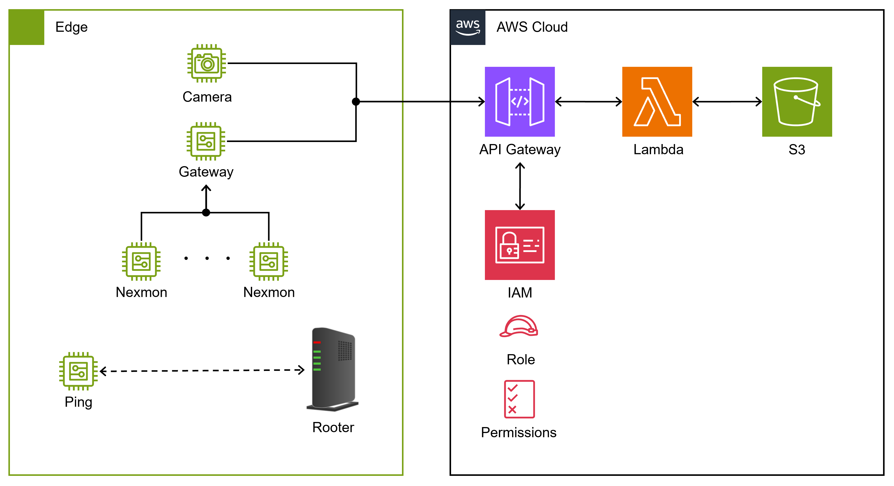

# 農業向けWi-Fi CSIセンシングプラットフォーム（機械学習）

本リポジトリは，峰野研究室において開発された，農業現場における Wi-Fi CSI (Channel State Information) センシングデータを活用した機械学習モデルの開発・評価を行うためのリポジトリです．
本プロジェクトでは，Nexmon を用いたWi-Fi CSIデータの収集，前処理，特徴抽出，および機械学習を用いた解析を行い，農業における環境モニタリングや作業評価への応用を目指しています．

## システム概要図

本プロジェクトは，スマート農業の発展を支援し，持続可能な農業技術の実現を目指しています．